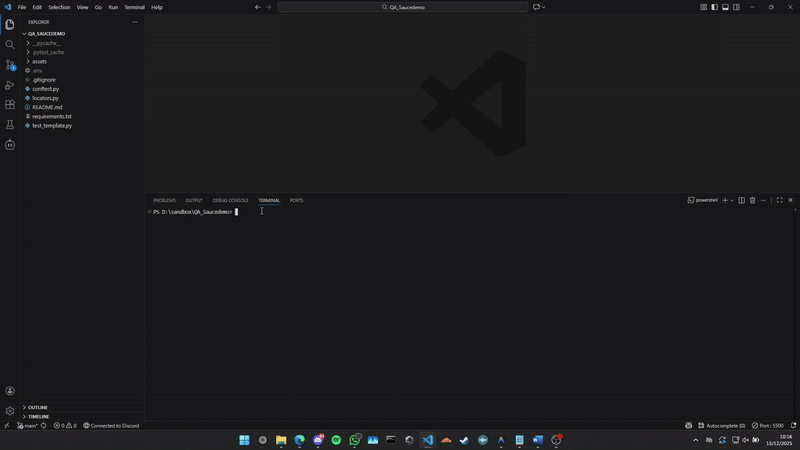
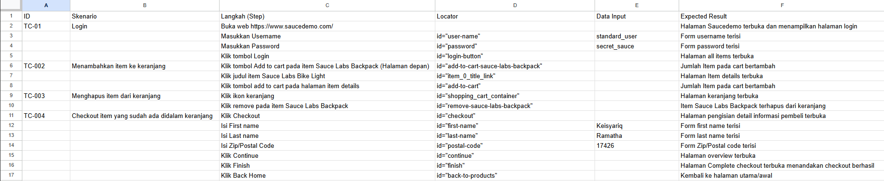

# 🧪 SauceDemo Automation Testing


Automated testing project untuk website [Saucedemo](https://www.saucedemo.com/) menggunakan **Selenium WebDriver** dan **Pytest**.

## 🎥 Demo Preview



## 📋 Test Cases



> 📥 **[Download Full Test Case (PDF)](./assets/screenshots/testcase.pdf)**

Project ini mencakup 4 test case utama yang mensimulasikan alur belanja lengkap:

| TC ID | Nama Test | Deskripsi |
|-------|-----------|-----------|
| TC-01 | Login | Verifikasi proses login dengan kredensial valid |
| TC-02 | Add to Cart | Menambahkan 2 barang ke keranjang belanja |
| TC-03 | Remove from Cart | Menghapus 1 barang dari keranjang |
| TC-04 | Checkout | Proses checkout hingga selesai |

## 🛠️ Tech Stack

- **Python 3.x** - Bahasa pemrograman
- **Selenium WebDriver** - Browser automation
- **Pytest** - Testing framework
- **python-dotenv** - Environment variable management
- **Webdriver Manager** - Automatic driver management

## 📁 Struktur Project

```
QA_Saucedemo/
├── conftest.py         # Pytest fixtures (setup/teardown browser)
├── test_template.py    # Test cases
├── locators.py         # Element locators (Page Object Model)
├── requirements.txt    # Python dependencies
├── .env                # Environment variables (tidak di-commit)
└── assets/             # Assets folder
```

## 🚀 Cara Menjalankan

### 1. Clone Repository

```bash
git clone https://github.com/kei2511/saucedemo_automation_testing.git
cd saucedemo_automation_testing
```

### 2. Install Dependencies

```bash
pip install -r requirements.txt
```

### 3. Setup Environment Variables

Buat file `.env` dengan isi:

```env
WEB_USER=standard_user
WEB_PASS=secret_sauce
```

### 4. Jalankan Test

```bash
# Jalankan semua test
pytest test_template.py -v

# Jalankan dengan HTML report
pytest test_template.py -v --html=laporan.html
```

## 📊 Test Results

### Preview


### Summary

| Test | Deskripsi | Hasil | Durasi |
|------|-----------|-------|--------|
| TC-01 | Login dengan kredensial valid | ✅ Passed | 6s |
| TC-02 | Tambah 2 barang ke keranjang | ✅ Passed | 220ms |
| TC-03 | Hapus 1 barang dari keranjang | ✅ Passed | 141ms |
| TC-04 | Checkout sampai selesai | ✅ Passed | 3s |

**Total: 4 tests passed** dalam ~9 detik ⏱️

> 🔗 **[Lihat Report Interaktif (GitHub Pages)](https://kei2511.github.io/saucedemo_automation_testing/laporan.html)**

### Generate Report

Jalankan test dengan flag `--html` untuk generate report:

```bash
pytest test_template.py -v --html=laporan.html
```

## 🎯 Fitur

- ✅ **Sequential Testing** - Test berjalan berurutan untuk mensimulasikan user journey
- ✅ **Session Scope** - Browser tetap terbuka sepanjang session test
- ✅ **Page Object Model** - Locator terpisah untuk maintainability
- ✅ **Environment Variables** - Kredensial aman dengan `.env`
- ✅ **HTML Reporting** - Laporan hasil test yang informatif

## 👤 Author

**Keisyariq Ramatha**

---

⭐ Jika project ini membantu, jangan lupa kasih star!
